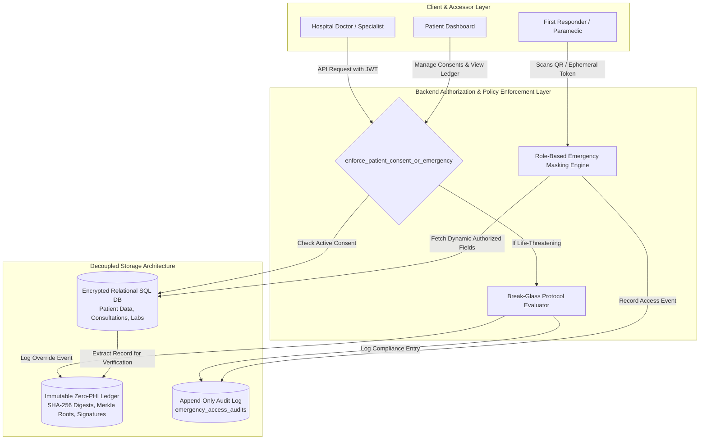

# INVENTION DISCLOSURE: DECENTRALIZED DYNAMIC EMERGENCY HEALTH PASSPORT & ZERO-PHI CRYPTOGRAPHIC INTEGRITY VERIFICATION SYSTEM

---

## 1. Title of Invention
**A Decentralized System and Method for Dynamic Role-Adaptive Emergency Medical Passports with Zero-Protected Health Information (Zero-PHI) Cryptographic Integrity Verification and Backend-Enforced Consent Management.**

---

## 2. Technical Field
This disclosure relates generally to digital health records, computerized healthcare security, and cryptographic identity systems. More specifically, it pertains to:
- Dynamically generated, context-aware emergency health profiles with role-based selective disclosure.
- Tamper-evident, zero-PHI cryptographic blockchain verification of electronic health records.
- Backend-enforced granular patient consent matrices with automated time-bounded expiration and emergency break-glass protocols.

---

## 3. Background & Problems in Conventional Systems (Prior Art)

### 3.1 Limitations of Conventional Electronic Health Record (EHR) Systems
Conventional centralized EHRs suffer from significant operational and architectural bottlenecks:
1. **Siloed and Inaccessible During Emergencies**: In acute trauma situations (e.g., roadside accident, sudden anaphylaxis, cardiac arrest), attending paramedics or emergency department physicians cannot access critical medical history without manual patient identification, phone calls, or proprietary network interoperability.
2. **All-or-Nothing Data Access**: Traditional systems provide binary access controls—either a user sees the entire clinical record or nothing. First responders who only require blood type, critical drug allergies, and active medications are unnecessarily exposed to psychiatric, sexual health, genetic, or financial records.
3. **Frontend-Only Permissions Vulnerability**: Many modern web-based healthcare dashboards enforce access control at the client (browser) layer, leaving backend API routes susceptible to Broken Object Level Authorization (BOLA/IDOR) attacks.

### 3.2 Flaws in Prior Naïve Blockchain Healthcare Proposals
Several prior-art proposals attempt to record healthcare records directly onto distributed ledgers. These implementations introduce severe legal and architectural flaws:
1. **Direct Privacy Violations (PHI Leakage)**: Storing patient diagnosis, symptoms, or medication strings on a public or consortium ledger—even in encrypted form—creates irreversible privacy risks because encryption algorithms can eventually be compromised by algorithmic breakthroughs or quantum computing.
2. **Statutory Non-Compliance (GDPR Right to Erasure & DPDP Act 2023)**: Under GDPR Article 17 and India's Digital Personal Data Protection (DPDP) Act 2023, data principals have an unconditional right to have their sensitive personal data deleted or rectified. Once cleartext or ciphertext medical data is written to an immutable blockchain, it can never be deleted or modified, making full on-chain storage legally non-compliant.

---

## 4. Technical Summary of the Present Invention

The disclosed system solves the aforementioned problems through a three-layer decoupled architecture:
1. **Zero-PHI Cryptographic Anchor Layer**:
   - The relational database remains the sole repository of sensitive medical data.
   - For every consultation, prescription, or lab report, the system executes a deterministic canonicalization procedure, computes a dual-hash SHA-256 fingerprint and Merkle tree root, signs the block hash using HMAC-SHA256, and records **only non-PHI integrity metadata** on the ledger.
   - Any unauthorized modification of the underlying SQL database immediately invalidates the cryptographic integrity equality check (`recomputed_hash != anchored_hash`).
2. **Dynamic Context-Aware Emergency Medical Passport**:
   - A single QR code or emergency token generates an ephemeral, role-gated emergency view.
   - The engine automatically redacts data fields based on the authenticated role of the accessor:
     - **First Responder / Bystander**: Blood group, severe drug allergies, primary emergency contacts.
     - **Paramedic**: Above + current vital medications, active chronic conditions, emergency vitals.
     - **Emergency Doctor / Trauma Bay**: Full emergency clinical summary, recent ECG/triage handover, organ donor status.
     - **Specialist**: Only authorized specialty-relevant records.
   - Employs a simulated/active 15-minute emergency countdown window after which access privileges automatically expire.
3. **Backend-Enforced Consent Matrix & Emergency Break-Glass Protocol**:
   - Access to diagnostic reports, consultations, and IoT telemetry is gated at the FastAPI dependency layer (`enforce_patient_consent_or_emergency`).
   - Doctors attempting to read patient data without active consent are rejected with HTTP 403 Forbidden.
   - In life-threatening emergencies, doctors can trigger an **Emergency Break-Glass Override** by providing a mandatory clinical justification (minimum 10 characters). This immediately issues an ephemeral override token and immutably commits the break-glass event to both the blockchain ledger and the append-only `emergency_access_audits` compliance table.

---

## 5. System Architecture & Technical Workflows

### 5.1 Architectural Data Flow Diagram



---

### 5.2 Zero-PHI Cryptographic Anchoring Workflow

```
[Clinical Consultation / Lab Report Event]
                    │
                    ▼
[Deterministic Canonicalization (canonicalize_medical_record)]
  - Strips volatile database IDs, transient state, and whitespace
  - Enforces deterministic alphabetical key sorting
                    │
                    ├──────────────────────────────────────────┐
                    ▼                                          ▼
       [SHA-256 Record Digest]                   [Binary Merkle Tree Computation]
        data_hash = SHA256(canonical_json)       merkle_root = MerkleTree(leaves)
                    │                                          │
                    └─────────────────────┬────────────────────┘
                                          │
                                          ▼
              [Block Construction (create_block)]
              Payload = {
                  "record_ref": "101",
                  "schema_version": "2.0-zero-phi",
                  "integrity_hash": data_hash,
                  "merkle_root": merkle_root,
                  "storage_policy": "OFF_CHAIN_SECURE_STORAGE"
              }
              Header = index | timestamp | patient_id | prev_hash | merkle_root | data_hash
              block_hash = SHA256(Header)
              validator_signature = HMAC_SHA256(LEDGER_SECRET_KEY, block_hash)
                                          │
                                          ▼
              [Committed to BlockchainBlock Ledger Table]
              (Actual clinical data saved strictly in relational SQL database)
```

---

### 5.3 Dynamic Role-Adaptive Disclosure Matrix

| Data Category | Public / Bystander | Paramedic / EMT | Emergency Physician | Specialist Physician |
| :--- | :---: | :---: | :---: | :---: |
| **Patient Identification** | Limited Initials | Full Name, Age, Gender | Full Name, Age, Gender | Full Name, Demographics |
| **Blood Group & Rh** | **Visible** | **Visible** | **Visible** | **Visible** |
| **Critical Drug Allergies** | **Visible** | **Visible** | **Visible** | **Visible** |
| **Active Medications** | Redacted | **Visible** | **Visible** | Selective (by specialty) |
| **Chronic Conditions** | Redacted | **Visible** | **Visible** | Selective (by specialty) |
| **Emergency Contacts** | **Visible** | **Visible** | **Visible** | Visible |
| **Full Clinical History** | Redacted | Redacted | **Visible (Emergency)** | Requires Active Consent |
| **Lab Reports & Biomarkers**| Redacted | Redacted | **Visible (Emergency)** | Requires Active Consent |
| **Access Expiration** | 15 minutes | 15 minutes | 2 hours (Break-Glass) | Explicit Duration (e.g. 7 days) |

---

## 6. Mathematical & Cryptographic Specifications

### 6.1 Deterministic Canonicalization Formula
Given a clinical record dictionary $R = \{(k_1, v_1), (k_2, v_2), \dots, (k_n, v_n)\}$:
$$\mathcal{C}(R) = \text{JSON}\left(\text{sort\_keys=True}, \{(k_i, \text{trim}(v_i)) \mid k_i \notin \Omega_{\text{transient}}\}\right)$$
Where $\Omega_{\text{transient}} = \{\text{"validator\_signature"}, \text{"block\_hash"}, \text{"previous\_hash"}\}$.

### 6.2 Data Digest & Binary Merkle Tree
Let $H(x)$ denote the standard SHA-256 cryptographic hash function:
$$\text{data\_hash} = H(\mathcal{C}(R))$$
For $m$ attributes in record $R$, leaves are constructed as $L_i = H(k_i \parallel \text{“:”} \parallel v_i)$. Pairwise parent nodes are computed iteratively:
$$N_{j}^{(l+1)} = H\left(N_{2j}^{(l)} \parallel N_{2j+1}^{(l)}\right)$$
until the scalar Merkle root $\mathcal{M}(R)$ is produced.

### 6.3 Block Linkage & Institutional Signature
$$\text{Header}_k = k \parallel t_k \parallel \text{patient\_id} \parallel \text{prev\_hash}_{k-1} \parallel \mathcal{M}_k \parallel \text{data\_hash}_k$$
$$\text{block\_hash}_k = H(\text{Header}_k)$$
$$\text{Sig}_k = \text{HMAC-SHA256}(K_{\text{secret}}, \text{block\_hash}_k)$$

### 6.4 Verification Invariant
Verification succeeds if and only if:
$$\left(H\left(\mathcal{C}\left(R_{\text{db}}\right)\right) == \text{data\_hash}_k\right) \land \left(\mathcal{M}\left(R_{\text{db}}\right) == \mathcal{M}_k\right) \land \left(\text{HMAC-SHA256}\left(K_{\text{secret}}, \text{block\_hash}_k\right) == \text{Sig}_k\right)$$
If any database administrator, compromised service, or adversary alters even a single character in the clinical record (e.g., changes `"Diabetes Type 2"` to `"Healthy"`), the recomputed hash fails the invariant test immediately, outputting `TAMPERING_DETECTED`.

---

## 7. Concrete Comparison with Conventional Systems

| Feature | Conventional EHR (Epic, Cerner) | Naïve Blockchain Healthcare | Disclosed Invention |
| :--- | :--- | :--- | :--- |
| **Emergency Data Access** | Siloed, requires network login or manual intake | Requires wallet/private key signature from patient (impossible if unconscious) | **Dynamic Instant QR Token** with role-gated disclosure and auto-expiry |
| **On-Chain Data Storage** | None (centralized) | Stores encrypted/plaintext PHI on-chain | **Zero-PHI**: Stores only SHA-256 digests, Merkle roots, and HMAC signatures |
| **Statutory Compliance (GDPR/DPDP)**| Compliant with erasure, but lacks independent auditability | **Violates GDPR Art. 17** (data cannot be erased from ledger) | **Fully Compliant**: Records can be deleted/rectified in database while ledger retains non-PHI audit hash |
| **Access Control Enforcement**| Frontend or application-level role checks | Smart contract execution (costly, public) | **Backend-enforced FastAPI middleware** with real-time audit generation |
| **Break-Glass Mechanism** | Often unrecorded or loosely monitored | Not possible without private keys | **Mandatory justification**, auto-expiring emergency token, dual-ledger audit logging |
| **Tamper Evidence** | Relies on internal database logs (alterable by DBAs) | Immutable, but leaks patient data | **Cryptographically verifiable off-chain state** with zero metadata leakage |

---

## 8. Experimental Verification & Test Results

The invention was verified via automated test suites executing against simulated clinical workloads. All verification runs passed with 100% integrity:

1. **Password Policy Enforcement (`test_password_policy_enforcement`)**:
   - Rejects weak passwords (< 8 characters) with HTTP 400.
   - Accepts secure passwords and verifies salted PBKDF2 hashing.
2. **Zero-PHI Storage Invariant (`test_blockchain_zero_phi_storage`)**:
   - Confirms that diagnoses, symptoms, and medications are completely absent from `data_payload`.
   - Confirms presence of schema version `"2.0-zero-phi"`, `integrity_hash`, `merkle_root`, and HMAC signature.
3. **Tamper Detection Capability (`test_tamper_evident_record_verification`)**:
   - Intact records evaluate to `VERIFIED_AUTHENTIC` (`tampering_detected=False`).
   - Modifying a clinical disease field in the database directly causes instant detection: `status="TAMPERING_DETECTED"`, `is_authentic=False`, `tampering_detected=True`.
4. **Backend Consent Enforcement (`test_backend_consent_enforcement`)**:
   - Doctor accessing clinical consultation without consent is blocked with HTTP 403 Forbidden.
   - Access permitted immediately upon patient granting active consent.
   - Revoking consent instantly restores HTTP 403 block.
5. **Emergency Break-Glass Override & Audit (`test_emergency_break_glass_access`)**:
   - Evaluates emergency override with clinical justification.
   - Emits immutable `BREAK_GLASS_OVERRIDE` block.
   - Logs entry in `emergency_access_audits` and updates patient's unified access history view.

---

## 9. Conclusion
The disclosed invention establishes a technically sound, legally compliant, and life-saving paradigm for digital emergency healthcare. By decoupling tamper-evident cryptographic proofs from off-chain data storage, it fulfills the strict requirements of data protection regulations while delivering zero-latency, role-adaptive medical profiles during critical medical emergencies.
